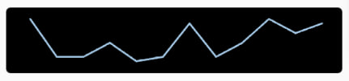

# Line Chart

Bare React Native minimalistic line chart

### Example of components with default properties


```tsx
import LineChart from './LineChart/LineChart';

const items = [
  {value: 3},
  {value: 2.2},
  {value: 2.2},
  {value: 2.5},
  {value: 2.1},
  {value: 2.2},
  {value: 2.9},
  {value: 2.2},
  {value: 2.5},
  {value: 3},
  {value: 2.7},
  {value: 2.9},
];

<LineChart items={items} />;
```

### Usage

Requires no additional libraries

### Properties

| Property        | Type     | Required | Description                                                                                                          |
| --------------- | -------- | -------- | -------------------------------------------------------------------------------------------------------------------- |
| items           | Object[] | Yes      | Items that will render. Use [{value: number}...] type                                                                |
| dotColor        | string   | No       | Color of chart's dots                                                                                                |
| lineColor       | string   | No       | Color of chart's lines                                                                                               |
| dotSize         | number   | No       | Size of chart's dots                                                                                                 |
| lineWidth       | number   | No       | Width of chart's lines                                                                                               |
| columnHeight    | number   | No       | Height of chart's columns                                                                                            |
| columnWidth     | number   | No       | Width of chart's columns (use only if chart width is static and calculate it as = container width / number of items) |
| containerStyles | Object   | No       | Styles that will be propagated to the container                                                                      |

### Example of using all styles properties



```tsx
<LineChart
  containerStyles={{backgroundColor: '#000', borderRadius: 5}}
  items={items}
  dotSize={2}
  dotColor="#a5cae8"
  lineColor="#a5cae8"
  lineWidth={2}
  columnHeight={50}
/>
```
